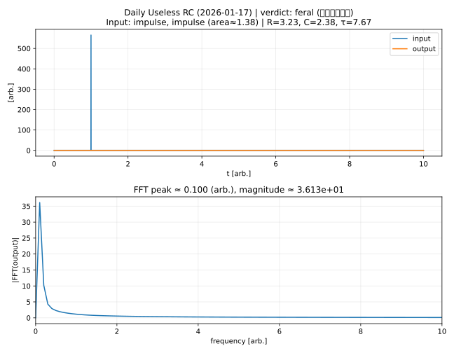

# Daily Useless Physics

Every day, GitHub Actions generates a **random dynamical system**
and excites it with a **random input signal**.

## Today's Result (2026-02-03)

- **System**: RLC
- **Filter kind (random by system)**: high
- **Parameters**: R=3.068, L=10.00, C=0.10, ωn=1.00, ζ=0.153, Q=3.26
- **Input**: step (A=1.32)

### Useless judgement
- **verdict**: **feral**
- overshoot-ish: 1.182
- wiggles: 3
- FFT peak (output): 0.200 (arb.)
- rough shape guess from |Y|/|X|: band/flat-ish

> We observed a rare event: uncontrolled confidence.

